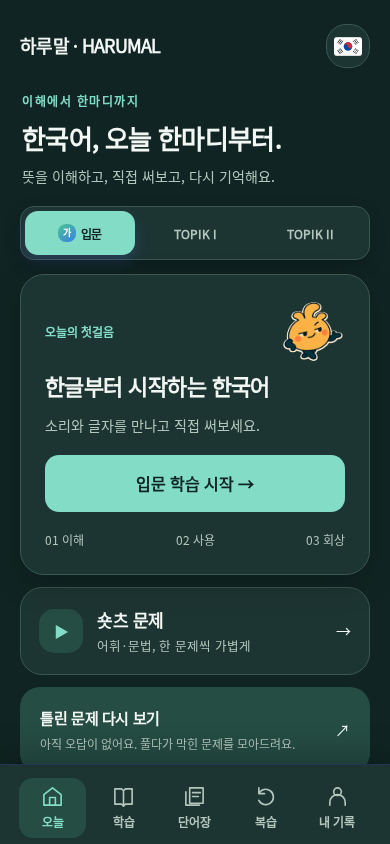
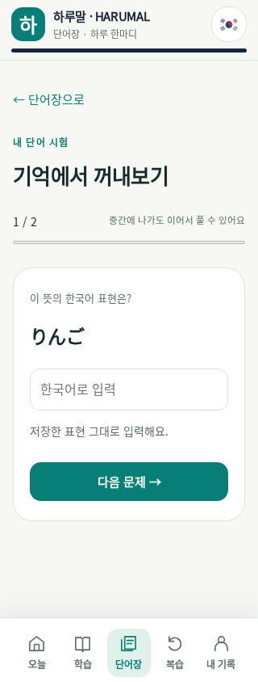

# Home and saved-word tests · v145

User-requested UI batch. Does not change original question IDs or claim learning efficacy.

- Nav: Today / Learn / Words / Review / My. Travel stays on Home; Shorts is directly visible.
- Flags are inline vectors with localized accessible button names.
- Home title uses the entire card width; mascot has a separate metadata row. All cuts retain alpha with a thin edge on dark surfaces.
- `vocab-test.js`: prompt from an existing saved meaning; ko UI uses Japanese meanings. Missing meanings and duplicate terms excluded. Up to ten words, NFC/whitespace normalization, exact saved expression scoring, no synonym claim. Draft and attempt live inside the existing portable core root. No SRS schedule mutations.
- `app-touch.js`: callout/selection/clipboard suppression plus stationary input hold blur. Physical Safari behavior still needs verification; ordinary typing and custom vocabulary holds are retained.
- Loading uses the original approved static cut animated with CSS as a temporary substitute. The previously generated MP4 and revised sheet were found but downloads returned HTTP 502. **Original frame animation integration remains open.** No artificial loading delay; honors reduced motion.

## Evidence

Local Node24 and Chromium153 with Noto CJK, 320/375/390/430px, both themes and four languages. Focused browser lane captures105 images and checks title/mascot separation, horizontal fit, nav, browser-dispatched pointer clicks with mobile touch emulation enabled, test input via browser, reload, result, retry, and reduced motion. Fixtures are synthetic and never represent learners.

Quick145/145; focused unit and storage tests pass. Full local check first160/161: generated Shorts inventory's topik1.js source hash was stale after Home edits. Regeneration changes only that hash; inventory check then passes. CI confirms the full161/161 automated checks. Two mobile attempts stopped after125 captures at an explicit reload with a destroyed CDP context; ready() now retries only expected navigation-context errors within its existing bounded wait. Assertions and screenshot coverage are unchanged. Final PR CI36362486464 passed full161/161, the existing293-image mobile lane with zero app-console errors, the focused105-image lane and street tiles (416 artifact images including tiles). The legacy navigation expectation was also updated from My to Words as requested. A separate local full mobile run stopped after245 images on an external translation ERR_EMPTY_RESPONSE; it is not counted as a pass.

Before screenshots were captured from v144. Home32 candidate screenshots were reviewed in four contact sheets; selected vocabulary and exam images were opened at original mobile size. Remaining captures are automated evidence, not claimed individually reviewed. Device Safari, Android and native long-press/IME are unverified.

Production target: https://okometsbu-beep.github.io/topik-quest/ . Rollback: v144 `d4647c8da2af6caf35a39e4d91bd0b605c41f524`. Final deployment/run/commit evidence is recorded in Issue #110.

## Deployment evidence

- PR204 squash: `4a6710761e8ed9bbad440e2ec86cc7e0d32881a6`.
- PR CI: https://github.com/okometsbu-beep/topik-quest/actions/runs/36362486464 .
- Pages success: https://github.com/okometsbu-beep/topik-quest/actions/runs/36362901464 . Main regression run: https://github.com/okometsbu-beep/topik-quest/actions/runs/36362901730 .
- Live v145 HTTP: four base and51 runtime files; SHA-256 equality for index, styles, Harumal CSS/JS, topik1, mascot, vocab-test, app-touch, bootstrap and worker.
- Returning public Chrome: loading → home, flag menu, Words empty state, Shorts question and Home → Travel hub clicked successfully. No learner answers or synthetic vocabulary were submitted to the public session.
- Physical iOS/Android and previous frame-animation integration remain open. Rollback remains v144 above.
